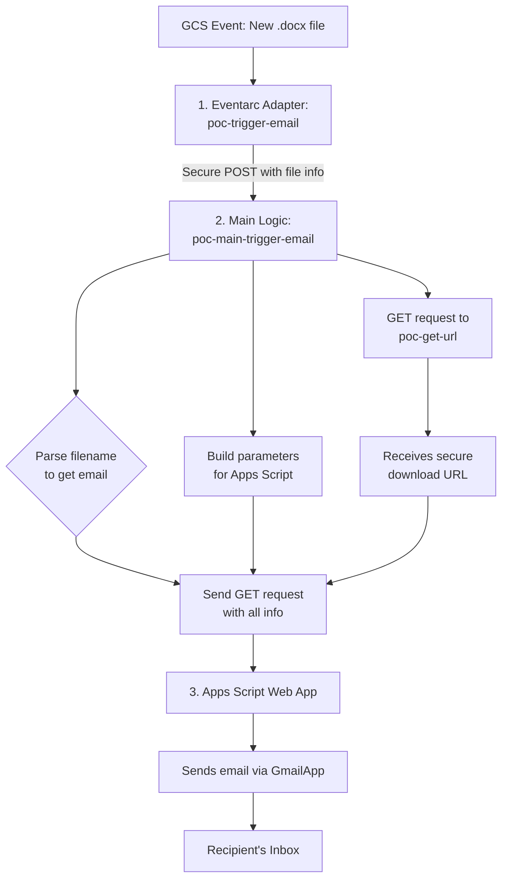

# 1- Function: Automated Drive-to-GCS File Ingestion System
## Name: upload-trigger-1
[View Cloud Run deployment for `upload-trigger-1`](https://console.cloud.google.com/run/detail/us-east1/upload-trigger-1/metrics?inv=1&invt=Ab0Umw&project=celtic-tendril-455220-v1)

## 1. Overview

This system provides an automated pipeline for ingesting meeting transcripts from a user's Google Drive into Google Cloud Storage (GCS).

It consists of two main components:
1.  A **Google Apps Script** that runs on a timer. It monitors a specific Google Drive folder for new transcript files (Google Docs, PDFs, etc.).
2.  An **HTTP-triggered Google Cloud Function** that acts as a secure backend. It receives file data from the Apps Script and uploads it to a designated GCS bucket.

The primary goal is to automatically capture the latest transcript from a "Meet Recordings" folder, enrich its filename with the user's name, and push it to the cloud for further processing, all without manual intervention.

---

## 2. Google Apps Script Component

The Apps Script code (`main.gs`) is the core of the automation. It runs periodically in the background to check for and process new files.

* **File:** `main.gs`
* **Manifest:** `appscript.json` (enables advanced Drive, Workspace Events, and Sheets APIs)

### 2.1. Automation Setup

The automation is managed by a time-based trigger.

* **`configurarTrigger()`**: This is a **one-time setup function**. A user must run it manually from the Apps Script editor to start the automation.
* **`crearTriggerPeriodico()`**: Called by `configurarTrigger()`, this function creates a recurring trigger that executes the main logic (`buscarYSubirUltimaTranscripcion`) every **1 minute**, as defined by the `CHECK_INTERVAL_MINUTES` constant.

### 2.2. Core Logic: `buscarYSubirUltimaTranscripcion()`

This is the main function executed by the time-based trigger. It performs the following workflow:

1.  **Find Folder**: It searches the user's Google Drive for a folder named **`Meet Recordings`**.
2.  **Find Latest File**: It iterates through all files in that folder to identify the one with the most recent creation date.
3.  **Validate File Type**: It checks if the latest file is a supported document type (`Google Doc`, `PDF`, or `Word`).
4.  **Check for Duplicates**:
    * It retrieves the ID of the last successfully processed file, which is stored using `PropertiesService`.
    * It compares the latest file's ID with the stored ID. If they are the same, the script logs that there are no new files and stops, **preventing duplicate processing**.
5.  **Process New File**: If the file is new, the script proceeds:
    * It retrieves the active user's email address (e.g., `firstname.lastname@example.com`).
    * It calls `obtenerNombreApellidoDeEmail()` to format the email into a string like `firstname_lastname`.
    * A new filename is constructed by appending `-[formatted-user-name].pdf` to the original filename.
    * The file content is fetched as a blob and encoded into a **Base64 string**.
6.  **Upload via Cloud Function**: It calls `uploadFileToBucket()`, sending the new filename, Base64 data, and MIME type to the secure Cloud Function endpoint.
7.  **Update State**: If the upload is successful, it updates the `PropertiesService` with the ID of the file it just processed, ensuring it won't be processed again on the next run.

### 2.3. Helper Functions

* **`uploadFileToBucket(filename, base64Data, mimeType)`**: This function is the bridge to the cloud. It constructs a JSON payload and makes a `POST` request to the Cloud Function URL (`CLOUD_FUNCTION_URL`) to perform the upload.
* **`obtenerNombreApellidoDeEmail(email)`**: A utility that takes a full email address and returns a formatted string by taking the part before the `@` and replacing periods `.` with underscores `_`.

### 2.4. Unused Utility Functions

The script also contains helper functions that are available but are **not currently used** in the main workflow.

* **`obtenerListaDeReclutadores()`**: Designed to find a Google Sheet named "Recruiters" inside a "POC_ASSETS" folder and extract a list of emails from it.
* **`extractCandidateName(filename)`**: A complex function using multiple regular expressions to attempt to parse a candidate's name and an interviewer's name from various filename formats.
* **`sanitizeFileName(name)`**: A utility to clean up filenames by removing invalid characters.

---

## 3. Google Cloud Function Component

The Cloud Function (`main.py`) is the secure backend that receives the data from the Apps Script and performs the actual file upload to Google Cloud Storage.

* **File:** `main.py`
* **Function Name:** `upload_to_bucket`
* **Trigger:** **HTTP**. The `@functions_framework.http` decorator exposes this function as an HTTP endpoint that can be invoked via web requests.

### 3.1. Configuration

| Constant      | Description                                     | Default Value                     |
| :------------ | :---------------------------------------------- | :-------------------------------- |
| `BUCKET_NAME` | The target GCS bucket where files will be stored. | `"transcription_poc_uploads_raw"` |

### 3.2. Execution Flow

1.  **Receive Request**: The function is triggered by the `POST` request from the Google Apps Script.
2.  **Parse JSON**: It parses the incoming request to extract the JSON payload containing the file information.
3.  **Validate Input**: It checks for the presence of the required fields: **`filename`** and **`base64`**. If either is missing, it returns a `400 Bad Request` error.
4.  **Decode Data**: The **base64-encoded** string is decoded back into its original binary format (bytes).
5.  **Upload to GCS**:
    * It initializes the `google-cloud-storage` client.
    * It gets a reference to the target bucket (`BUCKET_NAME`).
    * It creates a new object (a "blob") in the bucket with the specified `filename`.
    * It uploads the decoded file bytes to this object using `upload_from_string()`.
6.  **Return Response**: On success, it returns a `200 OK` status with a JSON message confirming the upload. If any error occurs during the process, it returns a `500 Internal Server Error` with the error details.

 
 

---

# 2- Function: Interview Transcript Processor
## Name: process-transcription-fn-poc
[View Cloud Run deployment for `process-transcription-fn-poc`](https://console.cloud.google.com/run/detail/us-east1/process-transcription-fn-poc/metrics?inv=1&invt=Ab0Umw&project=celtic-tendril-455220-v1)

## 1. Overview

This document describes a Google Cloud Function designed to automatically process interview transcript files. The system is triggered when a new transcript file (PDF or text) is uploaded to a specified Google Cloud Storage (GCS) bucket.

The function performs the following key operations:
1.  **Downloads and Parses** the transcript file from GCS.
2.  **Validates** if the content corresponds to a job interview by checking for specific keywords.
3.  **Cleans and Structures** the dialogue, separating turns by speaker.
4.  **Generates Text Embeddings** of the conversation using Vertex AI.
5.  **Analyzes** the dialogue using a Generative AI model (Gemini 1.5 Flash) with a custom prompt to extract insights.
6.  **Saves the output** in two formats to a destination GCS bucket: a cleaned `.txt` file of the dialogue and a `.docx` file containing the AI-generated analysis.

---

## 2. Cloud Function: `process_transcription`

This is the main entry point for the service. It is designed to be triggered by a CloudEvent.

* **Trigger:** Google Cloud Storage - `google.cloud.storage.object.v1.finalized`. It activates whenever a new file is successfully created in the source bucket.
* **File:** `main.py`
* **Function Name:** `process_transcription`

### 2.1. Configuration Constants

The function's behavior is controlled by several constants defined at the top of the file:

| Constant | Description | Default Value |
| :--- | :--- | :--- |
| `PROJECT_ID` | The Google Cloud Project ID. | `"celtic-tendril-455220-v1"` |
| `BUCKET_NAME` | The source GCS bucket where transcripts are uploaded. | `"transcription_poc_uploads_raw"` |
| `BUCKET_DESTINO`| The destination GCS bucket for processed files. | `"transcription_poc_processed"` |
| `EMBEDDING_MODEL`| The Vertex AI model for generating text embeddings. | `"text-embedding-large-exp-03-07"` |
| `LLM_MODEL` | The Vertex AI Generative Model for analysis. | `"gemini-1.5-flash-002"` |
| `REGION` | The GCP region for Vertex AI services. | `"us-central1"` |
| `PROMPT` | The local path to the prompt template file. | `"prompt.prompt"` |
| `JOB_INTERVIEW_KEYWORDS` | A list of keywords to identify a job interview. | `[...]` |
| `MIN_KEYWORD_MATCHES`| Minimum number of unique keywords to be found. | `1` |

### 2.2. Execution Flow

1.  **Event Reception**: The function receives a CloudEvent containing metadata about the newly uploaded GCS object.
2.  **File Identification**: It extracts the `bucket` and `name` (filename) from the event data.
3.  **Candidate Name Extraction**: It calls `extract_candidate_name(file_name)` to parse the candidate's name from the filename, expecting it to be enclosed in parentheses `()`.
4.  **Transcript Processing**: It invokes `process_preparation()` to orchestrate the core text extraction and cleaning pipeline.
5.  **Dialogue Structuring**: The structured dialogue is extracted from the result of the previous step. If the dialogue is empty, a warning is logged.
6.  **Embedding Generation**:
    * The `TextEmbeddingModel` is initialized.
    * If the dialogue text is not empty, it calls `get_embeddings()` to convert the dialogue into a vector embedding.
7.  **Save Cleaned Transcript**: The structured dialogue is saved as a plain text file to `gs://[BUCKET_DESTINO]/TXT/[candidate_name].txt`.
8.  **Generative AI Analysis**:
    * A prompt template is loaded from the `prompt.prompt` file.
    * The `GenerativeModel` (Gemini) is invoked with the prompt and the full dialogue text.
    * The model's JSON response is parsed to extract the analysis.
9.  **Recruiter Name Extraction**: It calls `extract_reclut(file_name)` to get the recruiter's codename from the filename (the part after the last `-` and before `.pdf`).
10. **Create Analysis Document**:
    * The parsed JSON from the LLM is used to create a new `.docx` document.
    * The analysis is structured with headings and paragraphs.
11. **Upload Final Report**: The generated `.docx` file is uploaded to the root of the destination bucket: `gs://[BUCKET_DESTINO]/[candidate_name]-[recruiter_name].docx`.

---

## 3. Core Processing Logic & Helper Functions

### 3.1. Orchestration

* **`process_preparation(...)`**: A wrapper function that initializes and runs the main processing pipeline by calling `process_transcript_file`. It iterates through a list of files (in this case, just the one from the trigger event) and collects the results.
* **`process_transcript_file(...)`**: Orchestrates the initial parsing and validation steps.
    1.  Calls `download_and_extract_text()` to get the file's content.
    2.  Calls `clean_and_extract_dialogue_segment()` to isolate the dialogue.
    3.  Calls `is_job_interview()` to validate the content.
    4.  If valid, calls `parse_interview_dialogue()` to structure the conversation.
    5.  Returns a dictionary with the results, including the `is_interview` flag and the structured dialogue.

### 3.2. File and Text Processing

* **`download_and_extract_text(bucket_name, file_name)`**: Connects to GCS, downloads the specified file as bytes, and extracts its text. It correctly handles both `.pdf` and plain text files.
* **`clean_and_extract_dialogue_segment(full_text_content)`**: Scans the raw text for a "Transcript" keyword (case-insensitive) and returns all text that follows this marker, effectively removing headers or metadata.
* **`is_job_interview(text, keywords, min_keyword_matches)`**: Determines if the text is a job interview by counting the number of unique keywords from `JOB_INTERVIEW_KEYWORDS` found in the text.
* **`parse_interview_dialogue(dialogue_text, primary_speaker_known_name)`**: Uses regex to split the cleaned dialogue text into turns based on speaker labels (e.g., "John Doe:"). It identifies a primary speaker and infers the other speaker's name, returning a list of dictionaries, e.g., `[{'speaker': 'Name', 'text': '...'}]`.
* **`comparar_cadenas_por_palabras(cadena_entrada, cadena_referencia, ...)`**: A utility function that compares two strings by checking if the majority of words in the first string are present in the second. This provides a flexible way to match speaker names that might have slight variations in the transcript.

### 3.3. Name Extraction (from Filename)

* **`extract_candidate_name(file_name)`**: Extracts the candidate's name by searching for the content within the first pair of parentheses `(...)` in the filename. Returns `"candidato_sin_nombre"` if no match is found.
* **`extract_reclut(file_name)`**: Extracts a recruiter's name or codename. It assumes this is the text segment after the final hyphen `-` and before the `.pdf` extension in the filename.

---

## 4. Dependencies

The function relies on the following key Python libraries:

* `functions-framework`: For deploying the code as a Google Cloud Function.
* `google-cloud-storage`: To interact with Google Cloud Storage for file download/upload.
* `google-cloud-aiplatform` / `vertexai`: To use Vertex AI services for text embeddings and generative models.
* `PyMuPDF` (imported as `fitz`): For parsing text content from PDF files.
* `python-docx` (imported as `docx`): For creating the final `.docx` analysis report.
* `numpy`: To handle the numerical embedding vectors.

 
 

---

# 3- Function: Eventarc to HTTP Adapter Function
## Name: poc-trigger-email
[View Cloud Run deployment for `poc-trigger-email`](https://console.cloud.google.com/run/detail/us-east1/poc-trigger-email/source?inv=1&invt=Ab0Umw&project=celtic-tendril-455220-v1)

## 1. Overview

The `poc-trigger-email` function is a secure **adapter** designed to bridge event-driven systems (like Google Cloud Storage) with a primary HTTP-triggered function. Its core responsibility is to listen for an event via **Eventarc**, authenticate itself, and then pass the event data to a separate HTTP endpoint in a secure manner.

This pattern is crucial for decoupling services. It allows an HTTP function to remain secure and independent while still being able to react to non-HTTP events, with this adapter handling the "translation" and authentication layer.

---

## 2. Cloud Function: `eventarc_adapter_function`

This is the main entry point, triggered by an event from Eventarc.

* **File:** `main.py`
* **Trigger:** **CloudEvent via Eventarc**. It's designed to be triggered by events like a file being finalized in a GCS bucket (`google.cloud.storage.object.v1.finalized`).
* **Environment Variable:**
    * **`HTTP_FUNCTION_URL`**: This is a **mandatory** variable that must contain the full URL of the primary HTTP function that this adapter will call.

### Execution Flow

1.  **Event Reception**: The function activates upon receiving a CloudEvent from Eventarc, which contains data about the triggering event (e.g., the name of the bucket and file).
2.  **Get Identity Token**: It immediately calls the `get_identity_token()` helper function. This is the most critical step, as it generates a secure, short-lived OIDC (OpenID Connect) token.
3.  **Prepare Authenticated Request**:
    * It creates an `Authorization` header containing the OIDC token (`Bearer [token]`). This proves to the receiving HTTP function that the call is coming from an authorized source (this function's service account).
    * It prepares a JSON payload containing the relevant data extracted from the original event, such as the `bucket` and `name` of the file.
4.  **Invoke Primary Function**: It makes a `POST` request to the `HTTP_FUNCTION_URL`, including the authorization header and the JSON payload.
5.  **Log and Exit**: It logs the result of the HTTP call. If the primary function returns an error, this adapter function will also fail, ensuring that errors are visible in the logs and that the event can be retried if configured.

---

## 3. Security Helper: `get_identity_token()`

This helper function is central to the security of the entire process. It ensures that the adapter can make authenticated calls to other Google Cloud services.

* **Purpose**: To obtain a **Google-signed OIDC Identity Token** directly from the GCP metadata server, which is always available in a Cloud Function's runtime environment.
* **Audience**: When requesting the token, it specifies an **`audience`**, which is the URL of the service it intends to call (`HTTP_FUNCTION_URL`). This is a critical security feature: the generated token is cryptographically bound to that specific URL and cannot be used to call any other service, preventing "confused deputy" attacks.
* **Mechanism**: It makes a simple GET request to a special, internal `metadata.google.internal` URL. This is the standard and most robust method for a service to obtain credentials for itself within GCP.

 
 

---

# 4- Function: Automated Email Notification System for Processed Files
## Name: poc-trigger-email, poc-main-trigger-email
[View Cloud Run deployment for `poc-trigger-email` and `poc-main-trigger-email` ](https://console.cloud.google.com/run/detail/us-east1/poc-trigger-email/source?inv=1&invt=Ab0Umw&project=celtic-tendril-455220-v1, https://console.cloud.google.com/run/detail/us-east1/poc-main-trigger-email/source?inv=1&invt=Ab0Umw&project=celtic-tendril-455220-v1) 

## 1. Overview

This document describes a multi-stage, event-driven system designed to send an email notification when a processed interview analysis file is ready. The notification includes a secure, temporary download link for the file.

The workflow is triggered when a new analysis file (e.g., `candidate-name-recruiter_name.docx`) appears in a Google Cloud Storage (GCS) bucket.

The system is composed of three distinct components that work in sequence:
1.  **Eventarc Adapter (`poc-trigger-email`)**: A Cloud Function that listens for the GCS event and securely starts the main process.
2.  **Main Logic Function (`poc-main-trigger-email`)**: A second Cloud Function that fetches a secure download link for the file, derives the correct recipient email address from the filename, and calls the Apps Script.
3.  **Google Apps Script Emailer**: A Google Apps Script web app that receives the data and sends the final notification email via Gmail.

---

## 2. System Components

### 2.1. Component 1: Eventarc Adapter (`poc-trigger-email`)

This function acts as the secure entry point for the entire process.

* **Purpose**: To listen for GCS file creation events via Eventarc and securely invoke the main logic function.
* **Trigger**: CloudEvent via Eventarc, configured to watch for `google.cloud.storage.object.v1.finalized` in the processed files bucket.
* **Environment Variable**:
    * **`HTTP_FUNCTION_URL`**: Must be set to the trigger URL of the **Main Logic Function (`poc-main-trigger-email`)**.
* **Execution Flow**:
    1.  A new file ending in `_processed` (or as configured) is created in GCS.
    2.  Eventarc captures this event and triggers this adapter function.
    3.  The adapter generates a short-lived OIDC identity token to securely authenticate itself.
    4.  It makes a secure `POST` call to the Main Logic Function, passing the `bucket` and `name` of the new file.

*(This function's code and detailed documentation were provided previously.)*

### 2.2. Component 2: Main Logic Function (`poc-main-trigger-email`)

This HTTP-triggered function orchestrates the core tasks of fetching data and triggering the email.

* **File**: `main.py`
* **Trigger**: **HTTP**, called exclusively by the Eventarc Adapter.
* **Constants**:
    * **`WEB_APP_URL`**: The deployment URL of the Google Apps Script web app that will send the email.
    * **`SIGNED_URL_SERVICE`**: The URL of another service (`poc-get-url`) responsible for generating and providing temporary, secure download links (signed URLs) for files.
* **Execution Flow**:
    1.  Receives the `POST` request from the Eventarc Adapter containing the `bucket` and `name` of the file.
    2.  **Derives Recipient Email**: It calls the `transformar_cadena()` helper function on the filename. This function parses the filename to extract the recruiter's identifier, converts it into a valid email address (e.g., `recruiter_name` becomes `recruiter.name@devengine.ca`), and prepares it as the recipient address.
    3.  **Fetches Signed URL**: It makes a `GET` request to the `SIGNED_URL_SERVICE`. This service is expected to return a JSON list of all available files and their corresponding signed URLs. The function then finds the URL that matches the specific file from the trigger event.
    4.  **Triggers Apps Script**: It makes a `GET` request to the `WEB_APP_URL` (the Apps Script), passing the file `name`, `bucket`, the fetched `url`, and the derived `email` as URL query parameters.
    5.  Logs the outcome of the Apps Script call.

#### Helper Function: `transformar_cadena(cadena)`

* **Purpose**: To parse a filename and extract the recruiter's email address.
* **Logic**: It assumes a filename format like `[some-prefix]-[recruiter_identifier].docx`. It extracts the `recruiter_identifier`, replaces underscores `_` with periods `.`, and appends the domain `@devengine.ca`.

### 2.3. Component 3: Google Apps Script Emailer

This is the final component in the chain, responsible for the user-facing notification.

* **File**: `code.gs`
* **Trigger**: **HTTP GET**. It is deployed as a Web App and is triggered by the call from the Main Logic Function.
* **Entry Point**: `doGet(e)`
* **Execution Flow**:
    1.  The `doGet(e)` function is executed when the script's URL is called.
    2.  It accesses the event object `e` to read the URL parameters (`e.parameter.name`, `e.parameter.bucket`, etc.) sent by the Main Logic Function.
    3.  It constructs an email body containing the file details and the secure download link.
    4.  It uses the `GmailApp.sendEmail()` service to send a formatted email to the recipient's email address (which was also passed as a parameter).
    5.  It returns a simple text response ("OK" or "ERROR") to the calling Cloud Function to confirm its status.

---

## 3. Overall Workflow Diagram (Text)

 
 

---

# 5- AppScript Process Locations

Below are the key Google Apps Script projects used in this system, along with their direct edit links:

| Name                  | Script Editor URL                                                                                   |
|-----------------------|----------------------------------------------------------------------------------------------------|
| **POCGetSigned**      | [Open in Script Editor](https://script.google.com/home/projects/1HseR3YzWIgHJIXt9I5DUuAZfHdlMAMDZ2__EvWNu3nypsKM2ngWjoF40/edit) |
| **poc-notification-app** | [Open in Script Editor](https://script.google.com/home/projects/1LlxbFvbbMVIb2R4jbvQKfhMygFIb2bxM2AW19jS7X2AtkC9OvaY-I1t9/edit) |
| **drive_handler**     | [Open in Script Editor](https://script.google.com/home/projects/16VjN7MHiWfC3yfzBjfRsxtMhKvZUe2bSPExVwhj30OFzDvt3vg5BcMea/edit) |

You can view and manage all your Apps Script projects at [Google Apps Script Home](https://script.google.com/home).
